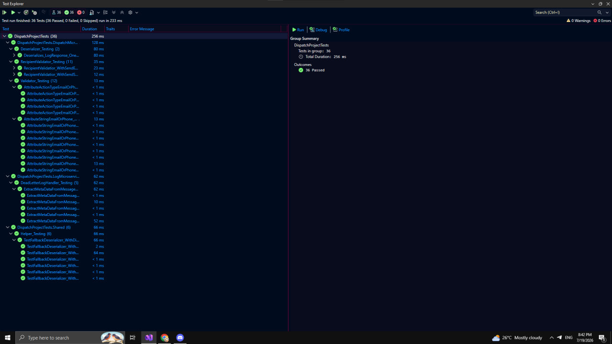

## Screenshots

### Main page — English, dark theme


### Main page — Ukrainian, dark theme

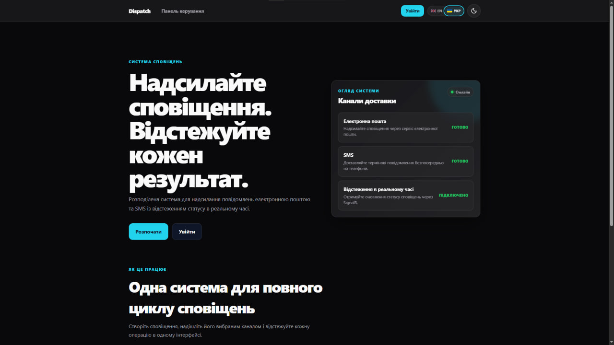

### Main page — Ukrainian, light theme

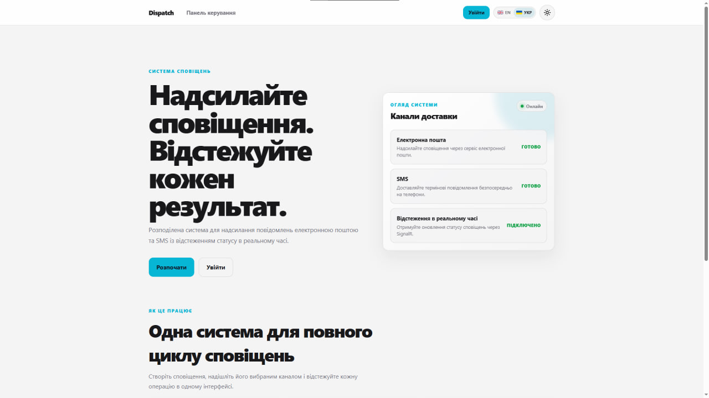

### Registration modal

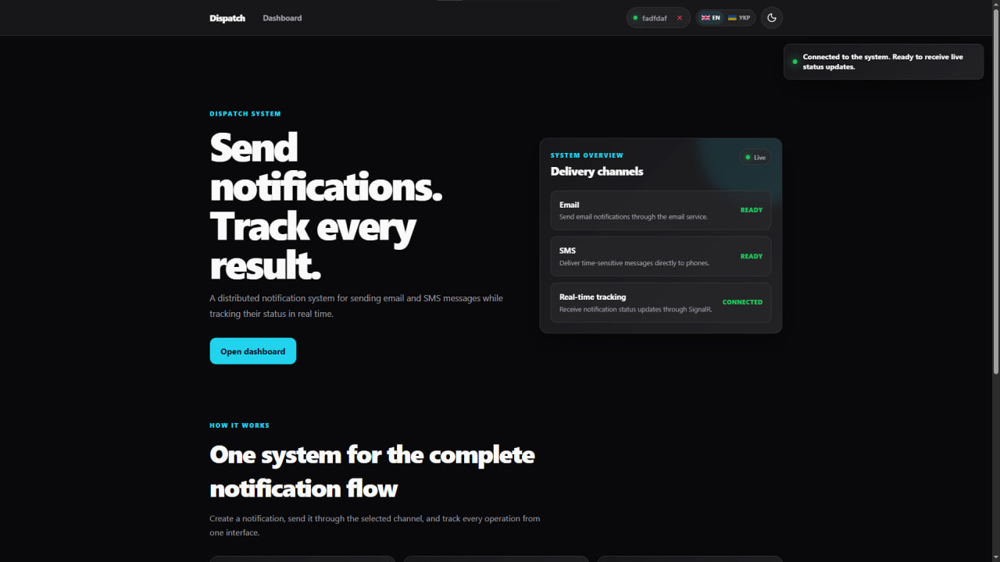

### Login modal — Ukrainian

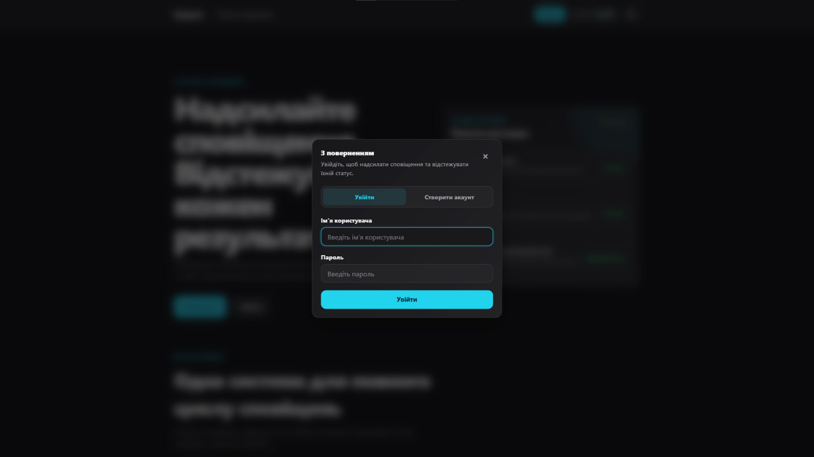

### Registration validation — English

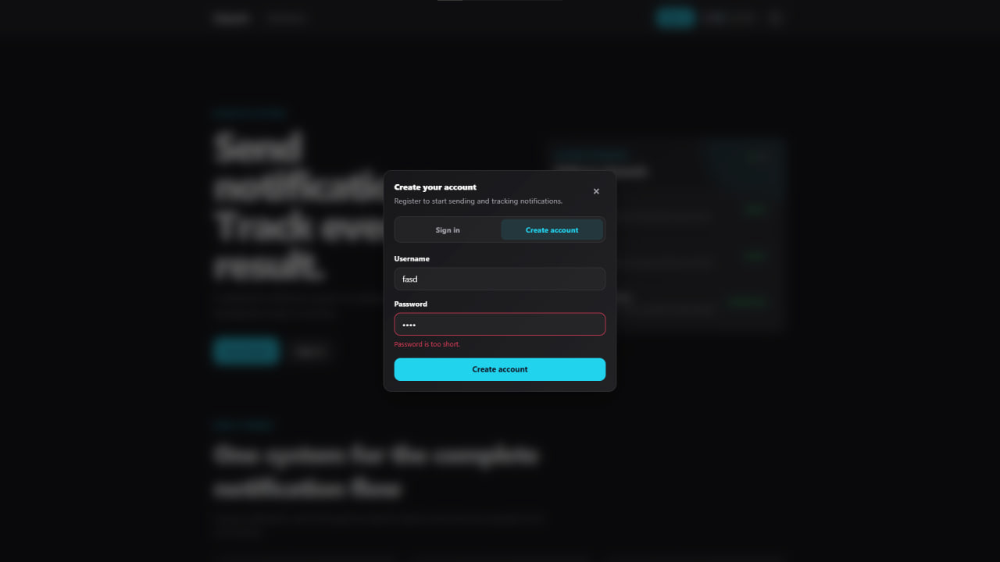

### Registration validation — Ukrainian

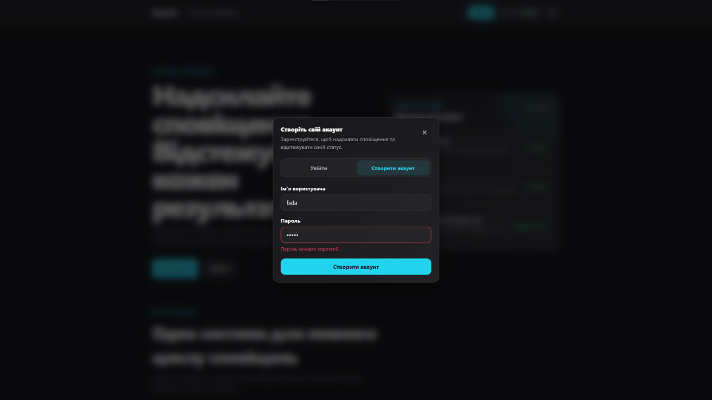

### Dashboard

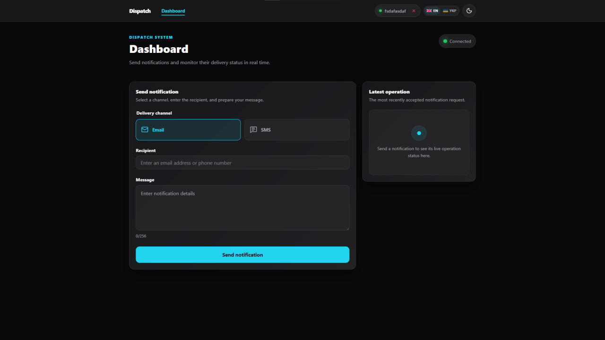

### Email queued

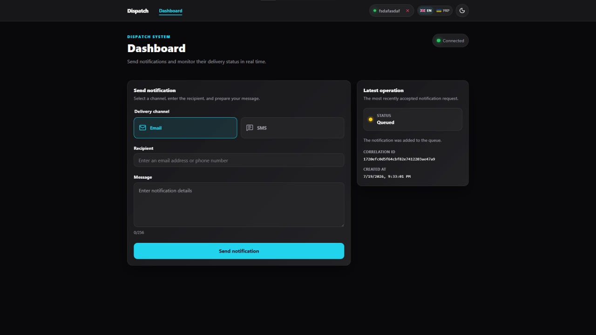

### Email sent

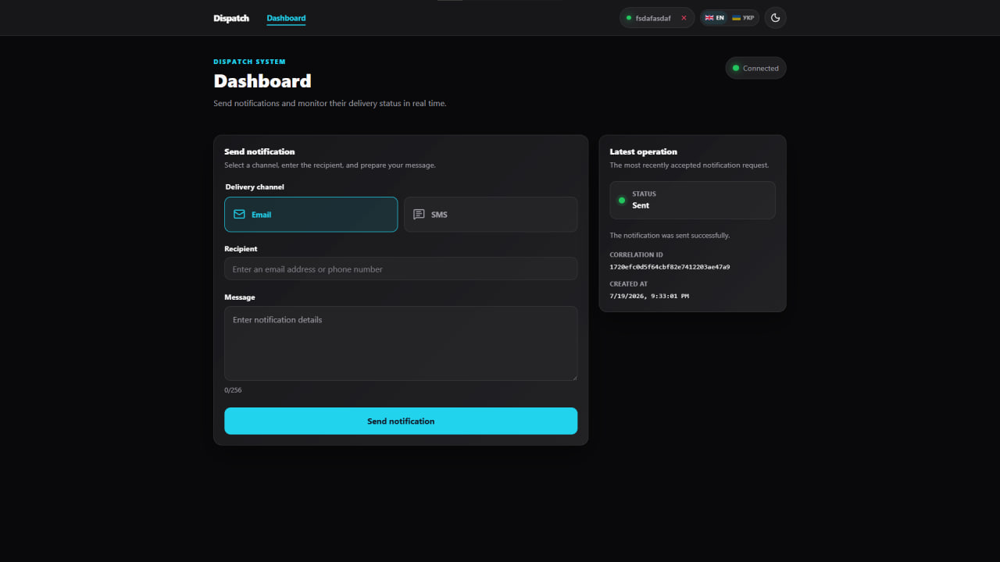

### Received email

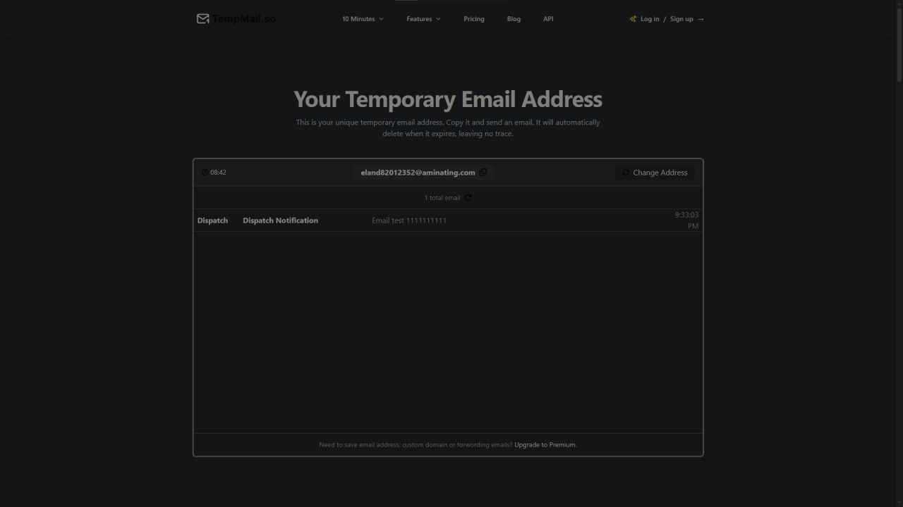

### SMS before sending


### SMS sent

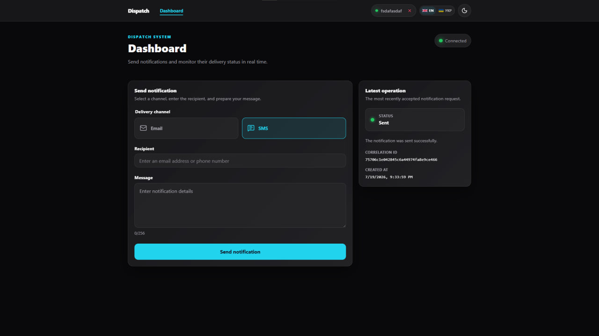

### Received SMS

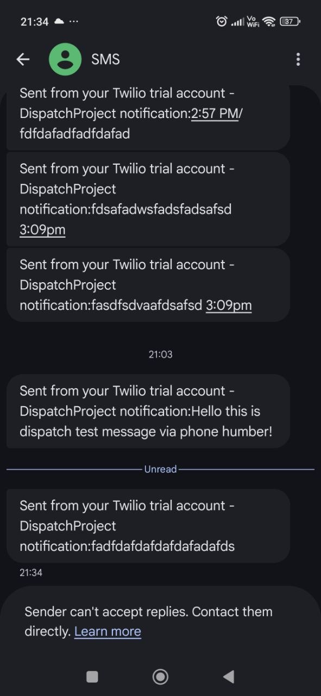

### Failed notification — dark theme


### Failed notification — light theme

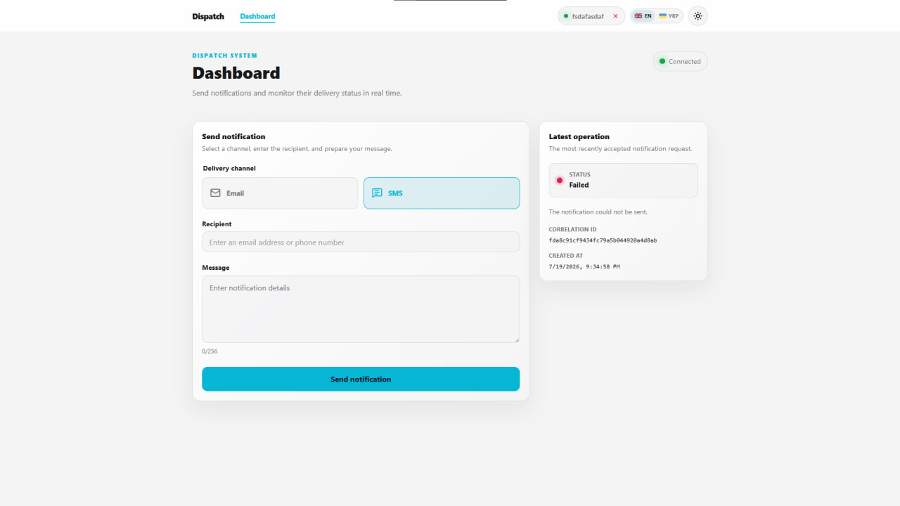

# DispatchProject

Full-stack notification system built with ASP.NET Core microservices and React.

The application accepts email or SMS notification requests, processes them asynchronously through Azure Service Bus, stores operation data and logs in SQL Server, and sends real-time status updates to the authenticated frontend user through SignalR.

## Architecture

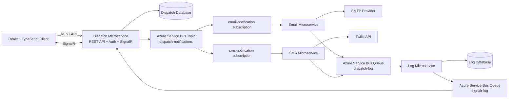

## Notification flow

```text
Authenticated user sends a notification request
    ↓
Dispatch Microservice validates the request
    ↓
A queued operation is stored in the Dispatch database
    ↓
The notification is published to the dispatch-notifications topic
    ↓
Azure Service Bus routes it to the email or SMS subscription
    ↓
Email Microservice or SMS Microservice processes the notification
    ↓
The result is published to the dispatch-log queue
    ↓
Log Microservice stores the result in the Log database
    ↓
Log Microservice publishes the operation result to signalr-log
    ↓
Dispatch Microservice receives the result
    ↓
SignalR sends the update to the authenticated user's group
    ↓
The frontend status changes from Queued to Sent or Failed
```

## Backend services

### Dispatch Microservice

- ASP.NET Core Web API
- ASP.NET Core Identity
- JWT authentication stored in an HttpOnly cookie
- Authorized endpoints
- Authorized SignalR hub
- User-specific SignalR groups
- Notification request validation
- Notification operation persistence
- Azure Service Bus topic publisher
- Azure Service Bus result consumer
- Unified API response contract
- Correlation IDs and operation IDs
- Global exception and validation handling

### Email Microservice

- Consumes messages from the `email-notification` subscription
- Sends email through an SMTP provider
- Publishes completed or failed processing results
- Supports Azure Service Bus retry behavior
- Supports dead-letter processing

### SMS Microservice

- Consumes messages from the `sms-notification` subscription
- Sends SMS through Twilio
- Publishes completed or failed processing results
- Supports Azure Service Bus retry behavior
- Supports dead-letter processing

### Log Microservice

- Consumes processing results from `dispatch-log`
- Stores notification logs in SQL Server
- Preserves correlation and owner identifiers
- Publishes operation results to `signalr-log`
- Provides persistent processing history

### Shared library

The shared class library contains contracts used by the backend services:

- Azure Service Bus DTOs
- Response contracts
- Response codes
- Enums
- Shared constants
- Serialization interfaces
- Validation response data

The Shared project is compiled into the services that reference it. It is not a separately running microservice.

## Azure Service Bus topology

| Type | Name | Purpose |
|---|---|---|
| Topic | `dispatch-notifications` | Receives notification requests from Dispatch Microservice |
| Subscription | `email-notification` | Routes email requests to Email Microservice |
| Subscription | `sms-notification` | Routes SMS requests to SMS Microservice |
| Queue | `dispatch-log` | Receives processing results from Email and SMS microservices |
| Queue | `signalr-log` | Sends persisted processing results back to Dispatch Microservice |

Dead-letter handling is implemented for queues and topic subscriptions.

Stored dead-letter metadata includes:

- queue or subscription source;
- dead-letter reason;
- dead-letter description;
- correlation ID;
- message ID;
- enqueue time;
- delivery count;
- message body when available.

## Databases

The project uses SQL Server and Entity Framework Core.

### Dispatch database

Stores:

- Identity users;
- authentication data;
- notification operations;
- correlation IDs;
- operation status;
- creation timestamps;
- update timestamps.

### Log database

Stores:

- notification processing logs;
- email and SMS recipients;
- notification details;
- action type;
- processing status;
- correlation ID;
- owner ID;
- creation timestamp.

Entity Framework Core migrations are included.

## Authentication and authorization

Authentication is implemented with ASP.NET Core Identity and JWT.

The JWT is stored in an HttpOnly cookie and is automatically included in API and SignalR requests.

Protected functionality includes:

- notification dispatch;
- current-user endpoint;
- logout;
- dashboard route;
- SignalR hub connection.

SignalR connections are added to user-specific groups based on the authenticated user ID.

`OwnerId` identifies the user who should receive the update.

`CorrelationId` identifies the individual notification operation across the complete microservice flow.

## API response contract

REST endpoints use a unified response format.

Success example:

```json
{
  "success": true,
  "code": "notification.queued",
  "data": {
    "createdAtUtc": "2026-07-19T18:00:00Z",
    "correlationId": "example-correlation-id",
    "status": "queued"
  }
}
```

Validation failure example:

```json
{
  "success": false,
  "code": "validation.invalid_request",
  "data": {
    "fields": {
      "recipient": "validation.recipient.invalid"
    }
  }
}
```

The frontend maps response codes to localized English or Ukrainian messages.

## Real-time status updates

The API initially returns the operation as `Queued`.

After processing finishes, SignalR updates the frontend operation to:

- `Sent`
- `Failed`

The update is delivered only to the authenticated user who created the notification.

## Frontend

The frontend is built with React, TypeScript, and Vite.

Implemented features:

- reusable component architecture;
- React Router;
- protected dashboard route;
- authentication context;
- login and registration modals;
- English and Ukrainian localization;
- dark and light themes;
- email and SMS channel selection;
- backend field-error mapping;
- SignalR connection management;
- real-time operation status updates;
- responsive layout;
- CSS Modules.

## Technologies

### Backend

- C#
- ASP.NET Core Web API
- ASP.NET Core Identity
- Entity Framework Core
- SQL Server
- Azure Service Bus
- SignalR
- JWT
- Twilio
- SMTP
- xUnit

### Frontend

- React
- TypeScript
- Vite
- React Router
- Axios
- Microsoft SignalR client
- CSS Modules

## Project structure

```text
DispatchProject/
├── Backend/
│   ├── src/
│   │   ├── DispatchMicroservice/
│   │   ├── EmailMicroservice/
│   │   ├── SmsMicroservice/
│   │   ├── LogMicroservice/
│   │   └── Shared/
│   └── DispatchProjectTests/
│
├── Frontend/
│   └── dispatch-client/
│       ├── public/
│       └── src/
│
├── Images/
├── .gitignore
└── README.md
```

## Configuration

Files matching `appsettings*.json` are excluded from Git because they contain local credentials.

Create local configuration files for the backend services and provide:

- SQL Server connection strings;
- JWT signing key;
- Azure Service Bus connection string;
- Azure topic, subscription, and queue names;
- SMTP credentials;
- Twilio account SID;
- Twilio authentication token;
- Twilio sender number.

Required Azure Service Bus entities:

```text
Topic:
dispatch-notifications

Subscriptions:
email-notification
sms-notification

Queues:
dispatch-log
signalr-log
```

Do not commit real connection strings, passwords, tokens, private phone numbers, or email credentials.

## Running the backend

From the `Backend` directory:

```bash
dotnet restore
dotnet build
```

Apply Dispatch Microservice migrations:

```bash
dotnet ef database update --project src/DispatchMicroservice/DispatchMicroservice.csproj --startup-project src/DispatchMicroservice/DispatchMicroservice.csproj
```

Apply Log Microservice migrations:

```bash
dotnet ef database update --project src/LogMicroservice/LogMicroservice.csproj --startup-project src/LogMicroservice/LogMicroservice.csproj
```

Run Dispatch Microservice:

```bash
dotnet run --project src/DispatchMicroservice/DispatchMicroservice.csproj
```

Run Email Microservice:

```bash
dotnet run --project src/EmailMicroservice/EmailMicroservice.csproj
```

Run SMS Microservice:

```bash
dotnet run --project src/SmsMicroservice/SmsMicroservice.csproj
```

Run Log Microservice:

```bash
dotnet run --project src/LogMicroservice/LogMicroservice.csproj
```

All four services must be running for the complete notification flow.

## Running the frontend

```bash
cd Frontend/dispatch-client
npm install
npm run dev
```

## Tests

The backend contains xUnit tests for:

- custom validation attributes;
- supported notification action types;
- email and phone validation;
- null and invalid values;
- message deserialization.

Run the test suite:

```bash
cd Backend
dotnet test
```

## Implemented concepts

- microservice architecture;
- event-driven architecture;
- asynchronous messaging;
- publish-subscribe messaging;
- queue-based communication;
- Azure Service Bus topics and subscriptions;
- multiple Azure Service Bus queues;
- retries and dead-letter queues;
- background workers;
- shared service contracts;
- correlation IDs;
- owner ID propagation;
- centralized logging;
- SQL persistence;
- real-time SignalR updates;
- JWT authentication with HttpOnly cookies;
- backend validation;
- unified API responses;
- frontend localization;
- reusable React components;
- responsive dark and light themes;
- unit testing.
